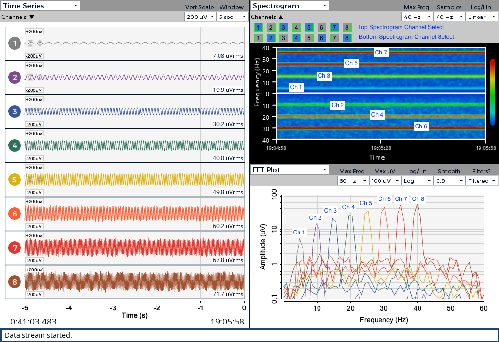

# EEG-Movement-Imagery
The project's goal is to be able to record electroencephalogram (EEG) data, which will be processed using a simple machine-learning algorithm to distinguish between moving your right hand and left hand. As a result, after gathering the trained data, two LEDs can be controlled to simulate whether the person is thinking to the left or the right.
This was my final project I did, for my Engineering Capstone project in order to complete im Diploma in Engineering and Fabrications Technology.

I have attached my paper explaining the process I went through explaining the project in much detail. The purpose was to help or intice others into the the world of mechatroincs.

